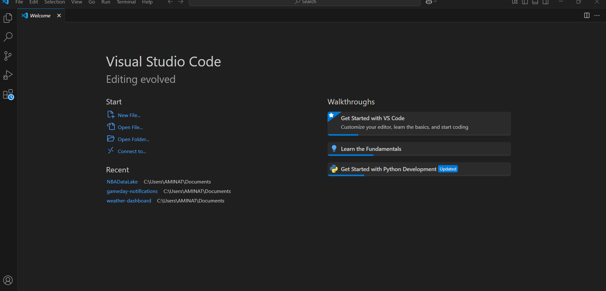
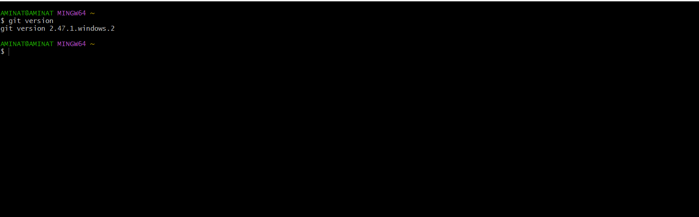
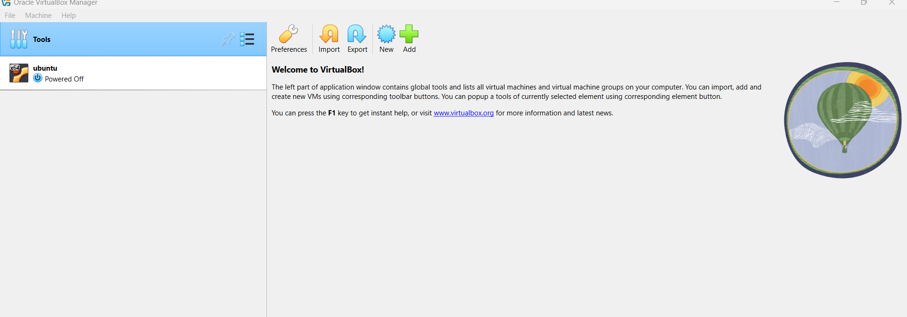
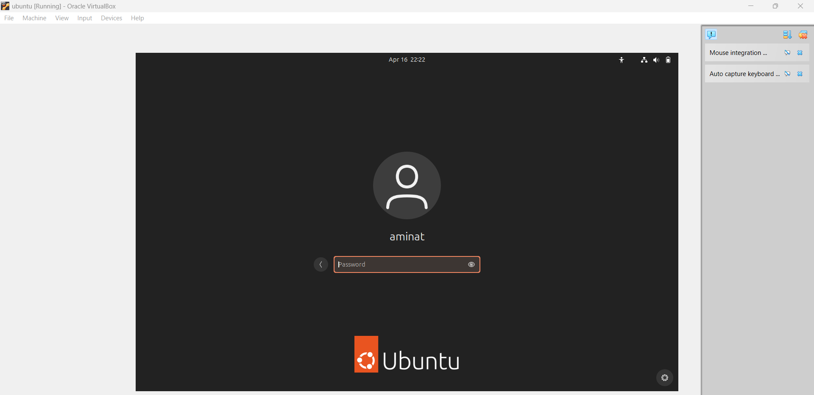
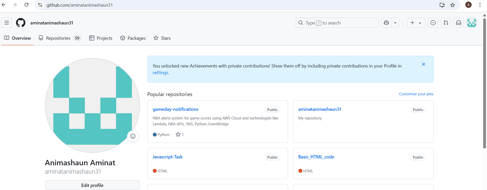
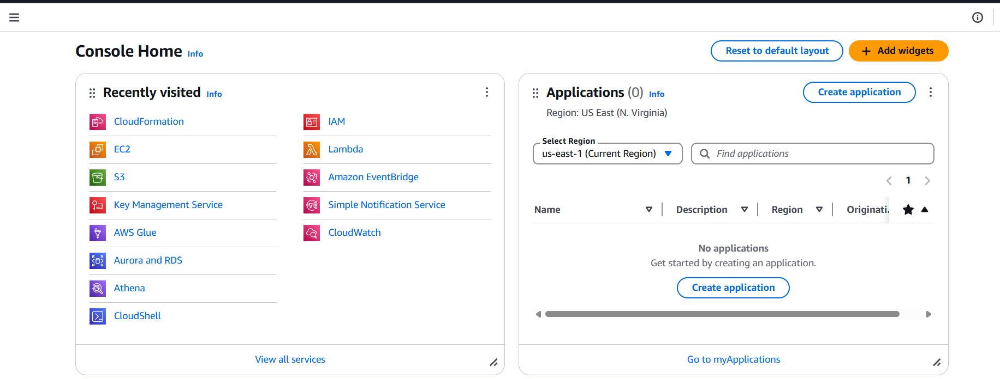

### Tech Environment Setup
## Introduction
This project is a showcase of the various application setup done on my local system in preparation for the DevOps program. The project consist of screenshots of all the software installed.
## Visual Studio Code

## Git Bash

## VirtualBox

The image above highlights the VirtualBox Manager interface, showcasing a configured virtual machine. As shown, this VM is allocated specific resources such as memory and storage, and it's running a guest operating system independently of the host.

Including this screenshot supports the practical application of virtualization—demonstrating how tools like VirtualBox make it possible to create, configure, and manage isolated environments for testing, training, or development.
## Ubuntu

## Github Account

## AWS Account

