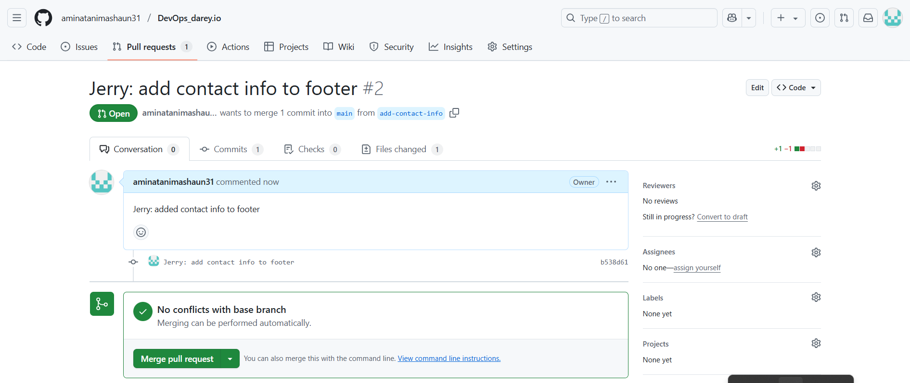

### GIT Version Control System
## Introduction
This repository is a showcase of how version control systems are utilised in software development within a team without having difficulties. A Version Control System is a vital tool in software development, designed to track and manage changes to code or documents over time. It enables multiple developers to collaborate on the same project efficiently, by controlling and merging changes made by different team members.
## Project Overview
This project demonstrates the basic use of Git for collaborative development. It simulates a scenario where two contributors (Tom and Jerry)  work together on the same HTML file using branches, commits, and pull requests.
* Tom works on updating the navigation bar
* Jerry works on adding contact information to the footer
* Both developers Collaborate on the same file without overwriting each other’s work.
* Changes are merged in a controlled manner
## Development Workflow
1. ### Cloning the Repository
Both contributors clone the central DevOps repository from GitHub to their local machines:
```bash
git clone https://github.com/aminatanimashaun31/DevOps_darey.io.git
```


They navigate into the cloned repository and create a new project directory:
```bash
cd DevOps
mkdir 02-version-control-system
cd 02-version-control-system
```
2. ### Initial Setup
The project is initialized with two files:
* `index.html`: Basic HTML structure with placeholders for navigation and footer.
* `README.md`: Project documentation.
3. ### Feature Branch Creation
* Tom creates a branch `update-navigation` to update the navigation bar section.
```bash
git checkout -b update-navigation
```

* Jerry creates a branch `add-contact-info` to add contact information to the footer.
```bash
git checkout -b add-contact-info
```

Each developer works independently on their feature branch.

4. ### Making Changes
 * **Tom** updated the navigation bar section inside `index.html`.
* **Jerry** added contact information to the footer section inside `index.html`.

Each developer staged and committed their changes:
```bash
git add .
git commit -m "Updated navigation bar" # For Tom
```
```bash
git add .
git commit -m "Added contact information to footer" # For Jerry
```
4. ### Pull Request and Code Review
* **Tom** completes his changes, commits them, and pushes the branch to GitHub.
* He opens a Pull Request (PR) to merge `update-navigation` into `main`
```bash
git push origin update-navigation
```

* After review, Tom’s changes are merged into the main branch.


* **Jerry** then pulled the latest main updates into his local machine:
```bash
git checkout add-contact-info
git pull origin main
```
This ensured Jerry had Tom’s latest changes before continuing his work.
* **Jerry** pushed his updated branch and created a Pull Request:
```bash
git push origin add-contact-info
```

After review, Jerry’s Pull Request was also merged into `main`.


## Final Outcome
Through proper branching, Pull Requests, and GitHub merging:
* Both Tom and Jerry were able to work on the same file (index.html) without conflicts.
* All changes were properly reviewed, merged, and documented.
* The main branch now contains the latest version with both Tom's and Jerry's contributions.
```
<!DOCTYPE html>
<html>
<head>
  <title>Tom and Jerry Website</title>
</head>
<body>
    <nav>
        <ul>
          <li><a href="#">Home</a></li>
          <li><a href="#">About</a></li>
          <li><a href="#">Projects</a></li>
        </ul>
      </nav>

  <footer>
    <p>Contact: amminatanny.com</p>
  </footer>
</body>
</html>

```
## Codebase


