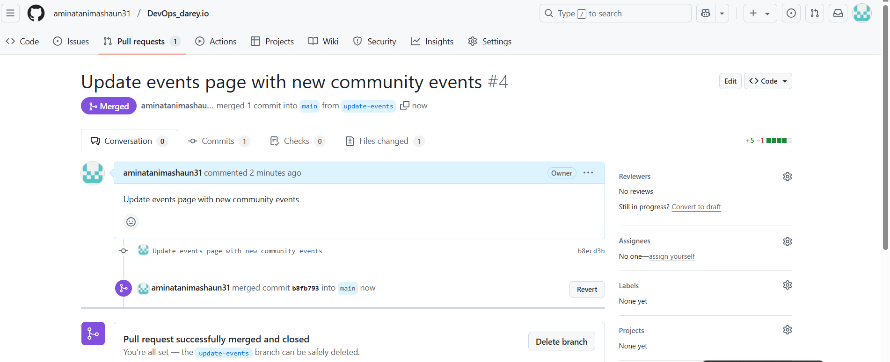

### Greenwood_library_website
## Project Overview
This project simulates the collaboration between two software engineers with the use of GitHub. The project involves step-by-step project to simulate workflow of Morgan and Jamie using Git and GitHub. The project includes the setting up a GitHub repository, cloning the repository, creation of branches, making changes, and merging those changes into the main branch.
* Morgan works on adding book-reviews
* Jamie works on updating events page
* Changes are merged in a controlled manner
## Development Workflow
1. ### Cloning the Repository
Clone the repository from GitHub to your local machine:
```bash
git clone https://github.com/aminatanimashaun31/greenwood-library-website.git
```

They navigate into the cloned repository and create a new project directory:
```bash
cd DevOps_darey.io
mkdir 04-greenwood-library-website
cd 04-greenwood-library-website
```
2. ### Initial Setup
The project is initialized with five files:
* `home.html`: Basic HTML structure
* `about_us.html` : Basic HTML structure
* `events.html`: Basic HTML structure
* `contact_us.html` : Basic HTML structure
* `README.md`: Project documentation.

3. ### Feature Branch Creation
* Morgan creates a branch `add-book-reviews` to add a new file.
```bash
git checkout -b add-book-reviews
```

* Jerry creates a branch `update-events` to update the events page.
```bash
git checkout -b update-events
```

Each developer works independently on their feature branch.

4. ### Making Changes
 * **Morgan** added book-reviews-page.
* **Jamie** updated events page.

Each developer staged and committed their changes:
```bash
git add .
git commit -m "added-book-reviews-page" # For Morgan
```
```bash
git add .
git commit -m "updated events page" # For Jamie
```
4. ### Pull Request and Code Review
* **Morgan** completes his changes, commits them, and pushes the branch to GitHub.
* He opens a Pull Request (PR) to merge `book-reviews` into `main`
```bash
git push origin add-book-reviews
```

* After review, Tom’s changes are merged into the main branch.


* **Jamie** then pulled the latest main updates into his local machine:
```bash
git checkout update-events
git pull origin main
```
This ensured Jamie had Morgan’s latest changes before continuing his work.
* **Jamie** pushed his updated branch and created a Pull Request:
```bash
git push origin update-events
```

After review, Jamie’s Pull Request was also merged into `main`.


## Final Outcome
Through proper branching, Pull Requests, and GitHub merging:
* Both Morgan and Jamie were able to work on the same project without conflicts.
* All changes were properly reviewed, merged, and documented.
* The main branch now contains the latest version with both Morgan's and Jamie's contributions.
