# Linux Fundamentals Mini Project
## Description
This project demonstrates the fundamental steps of Linux administration using AWS EC2 instances. It covers the process of accessing AWS services, managing EC2 instances, and establishing secure connections between local machines and cloud resources. This guide serves as a practical introduction to cloud-based Linux administration.
## Project Steps
## 1. AWS Console Access
The first step involves accessing the AWS Management Console. This is your central hub for managing all AWS services and resources.

### Key Points:
* Secure login through AWS Management Console
* Access to all AWS services and resources
* Dashboard provides overview of AWS environment
## 2. EC2 Instance Management
The EC2 (Elastic Compute Cloud) service page allows you to view and manage your virtual servers in the cloud.
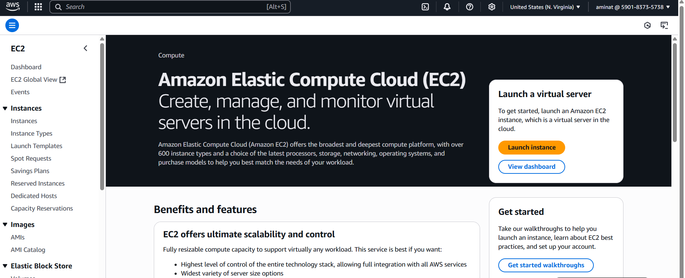
### Key Features:
* Overview of all EC2 instances
* Instance status and configuration details
* Resource utilization metrics
## 3. EC2 Instance Operations
Proper instance management is crucial for both cost optimization and security. This section demonstrates how to control your EC2 instances.
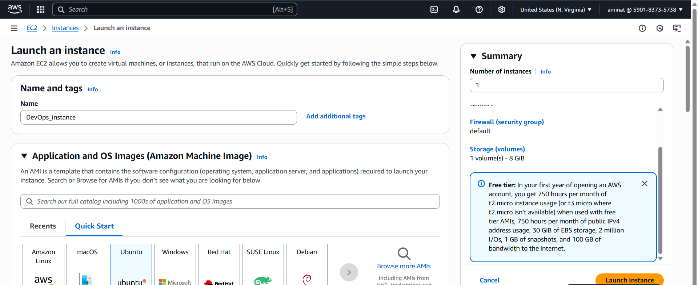

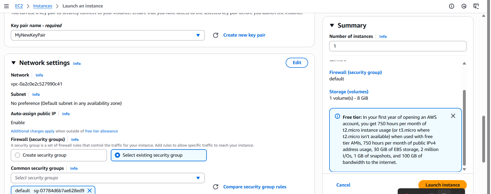

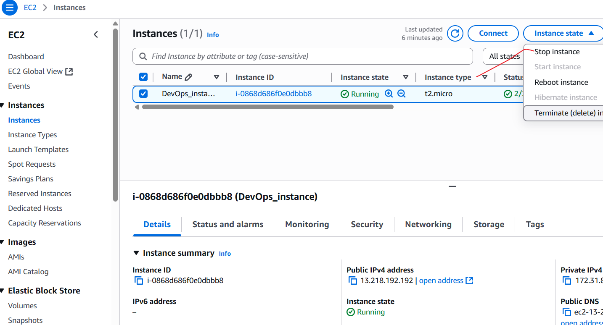
### Best Practices:
* Start instances only when needed
* Stop instances when not in use to optimize costs
* Monitor instance state regularly
* Use appropriate instance types for your workload
## 4. Installed MobaXterm
This section shows the screenshot of the MobaXterm installed on my local machine.
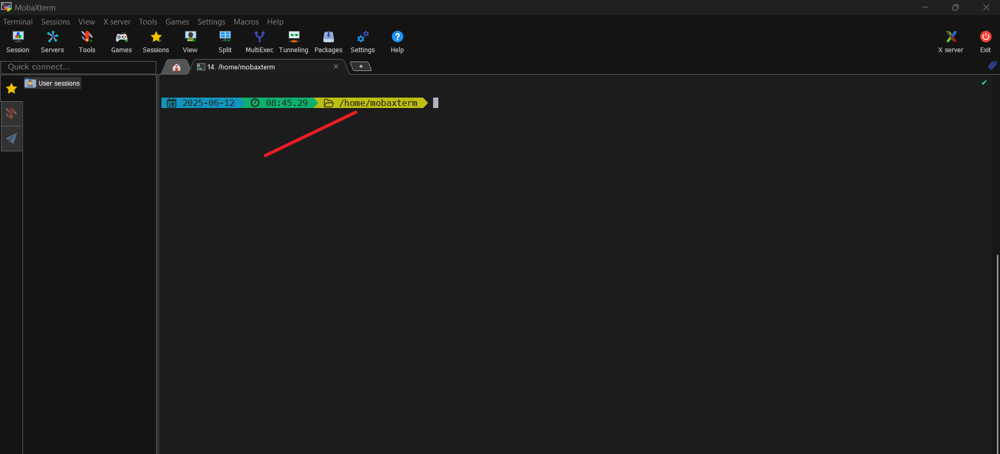
### Key Features:
* Secure SSH connections
* File transfer capabilities
* Terminal emulation
* Multi-platform support
5. ## Getting the public IP address of the EC2 instance
This section shows the screenshot of the public IP address of the EC2 instance.
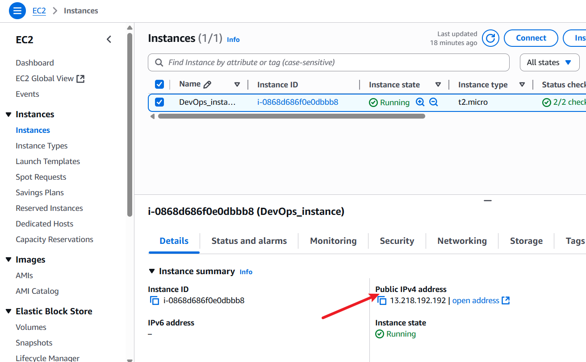

6. ## Connecting to the EC2 instance
This section shows the screenshot of the connection to the EC2 instance. Using the command below to connect to the EC2 instance
```bash
ssh -i "MyNewKeyPair.pem" ubuntu@ec2-13-218-192-192.compute-1.amazonaws.com
```
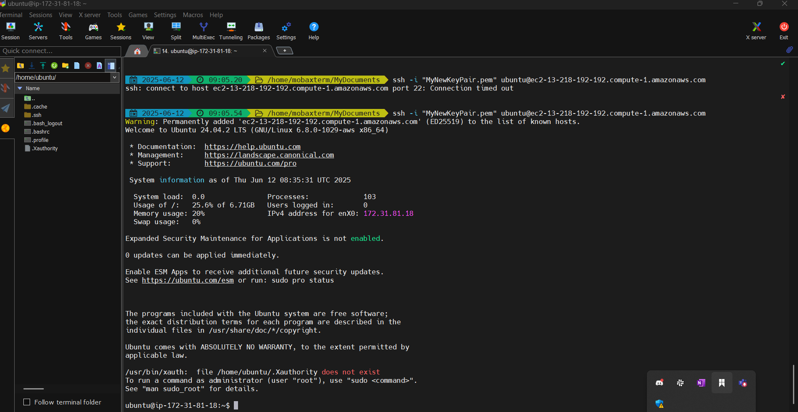
### Key Features:
* Connection to the EC2 instance
* SSH connection
* File transfer capabilities
7. ## Updating the package list
This section shows the screenshot of the package list. Using the command below to update the package list
```bash
sudo apt update
```
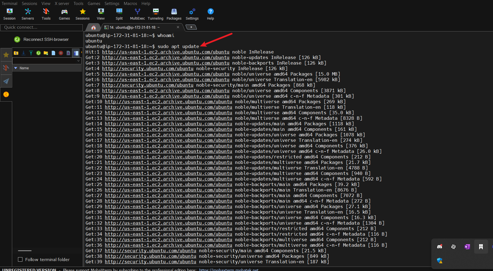
### Key Features:
* Updating the package list
8. ## Installing tree command
This section shows the screenshot of the tree command. Using the command below to install the tree command
```bash
sudo apt install tree
```
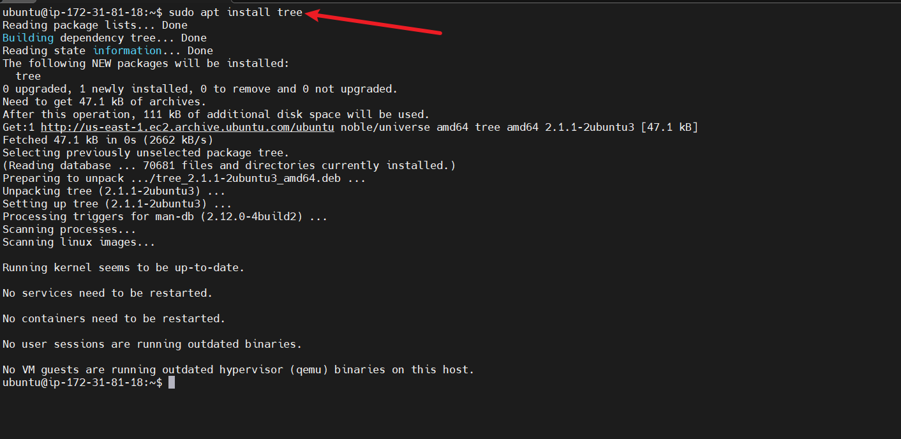
### Key Features:
* Installing the tree command
9. ## Using tree command
This section shows the screenshot of the tree command. Using the command below to use the tree command
```bash
tree / -L 1
tree / Documents
tree / Downloads
```
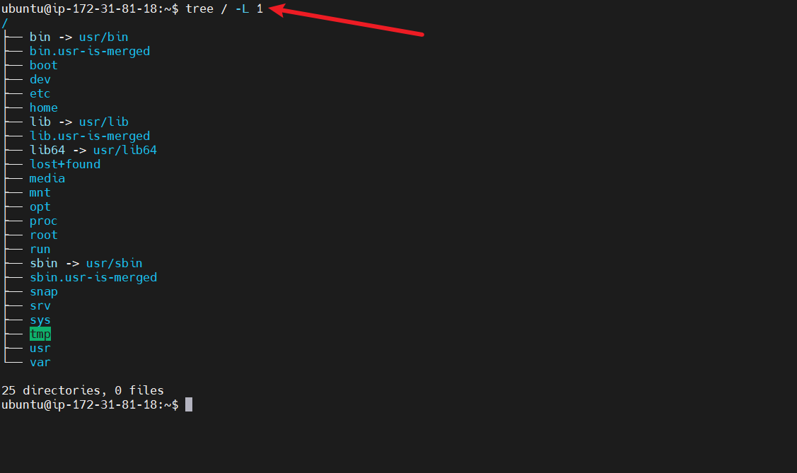

10. ## Upgrading the package
This section shows the screenshot of updating the package. Using the command below to upgrade the package
```bash
sudo apt upgrade
```
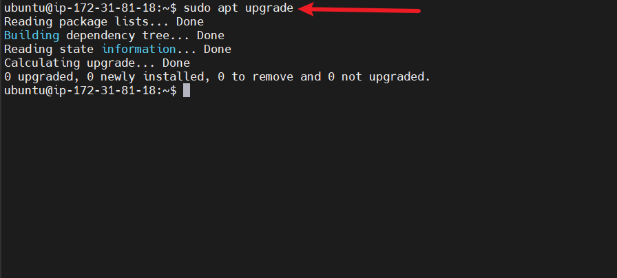

11. ## Removing tree command
This section shows the screenshot of removing the tree command.
```bash
sudo apt remove tree
```
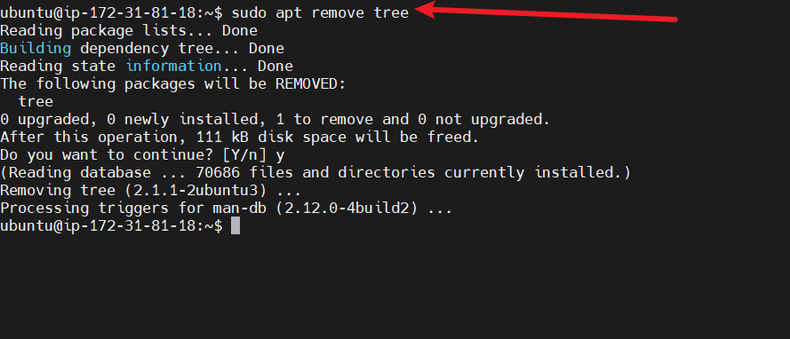

12. ## Installing Nginx
This section shows the screenshot of the installation of Nginx. Using the command below to install Nginx
```bash
sudo apt install nginx
```
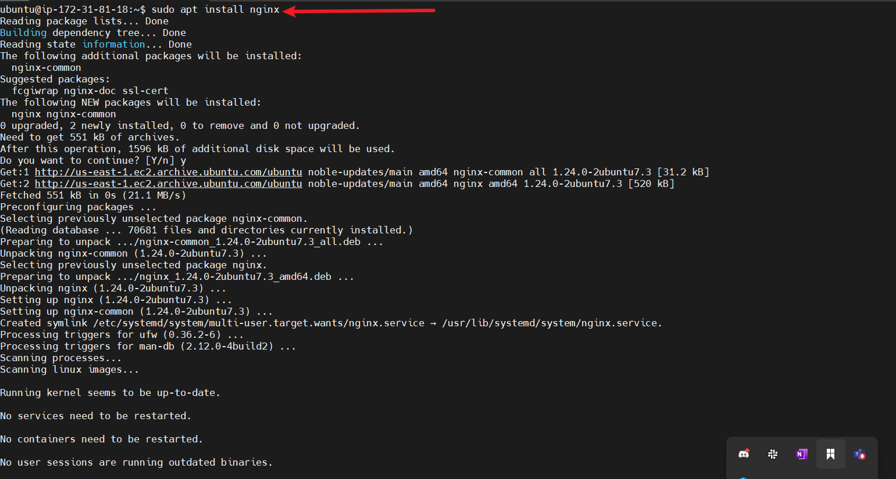