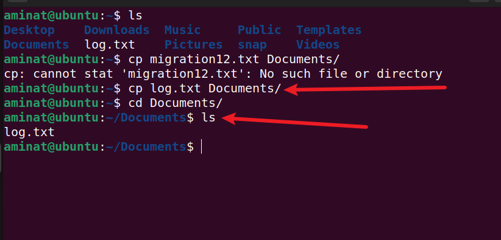

# Basic Linux Commands
A linux command refers to a program or utility that runs in the command-line interface(CLI). The CLI is atext based environment where interactions are made with the system by typing commands.

This project seeks to demostrate various linux commands and their operations.


```bash
## Side Hustle Task 1:
* Create a directory called `photos` inside the `/usr` directory
* Navigate into the `photos` directory
* Create 3 more random directories inside the `photos` directory
* Show the newly created directories on the terminal
* Navigate into one of them
* Show the full path where you currently are on the screen
```


## Cat command
To run the 'cat' command, type cat followed by the file name and its extension. For example
```bash
sudo cat /etc/os-release
```
Displays the content of 'os-release' file in the '/etc/' directory


## cp command
* Use the `cp` command to copy files or directories and their content. Take a look at the following use cases.
* To copy one file from the current directory to another, enter `cp` followed by the file name and the destination directory. For example:
```bash
cp log.txt /home/aminat/Documents/
```

* This will copy `log.txt` into the `/home/aminat/Documents/` directory. If you list the directory, you will find the file copied there.

* To copy multiple files to a directory, enter the file names followed by the destination directory:
```bash 
cp test1.txt test2.txt test3.txt /home/username/Documents
```


* To copy an entire directory, pass the -R flag before typing the source directory, followed by the destination directory:
```bash
cp -R /home/aminat/Documents /home/aminat/Desktop
```


## mv command
The primary use of the mv command is to move and rename files and directories. Additionally, it doesn't produce an output upon execution.
```bash
mv test2.txt /home/aminat/Downloads
```


* You can also use the `mv` command to rename a file.
```bash
mv test3.txt welcome.txt
```
## rm command
The rm command is used to delete files within a directory
* To remove a single file
```bash
rm test3.txt
```


## touch command
The touch command allows you to create an empty file.
* For example, enter the following command to create an HTML file named web in the Documents directory:
```bash
touch /home/aminat/Documents/Web.html
```


## find command
The find command is used to search for files within a specific directory and perform subsequent operations.
* Here's the general syntax:
```bash
find [option] [path] [expression]
```
* For example, you want to look for a file called `log.txt` within the home directory and its subfolders:
```bash
find /home -name log.txt
```


