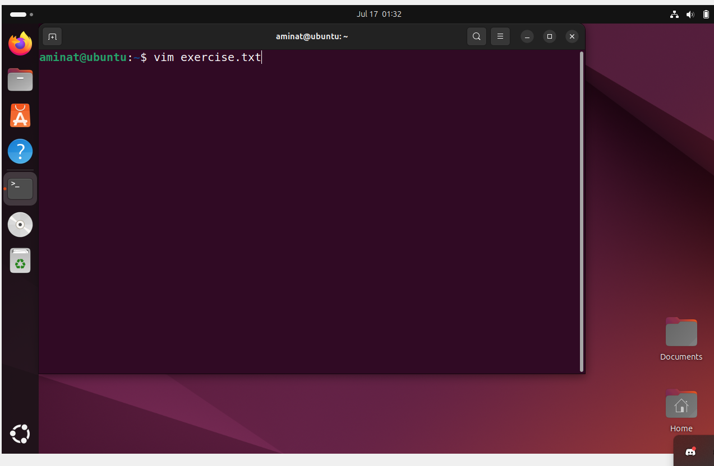
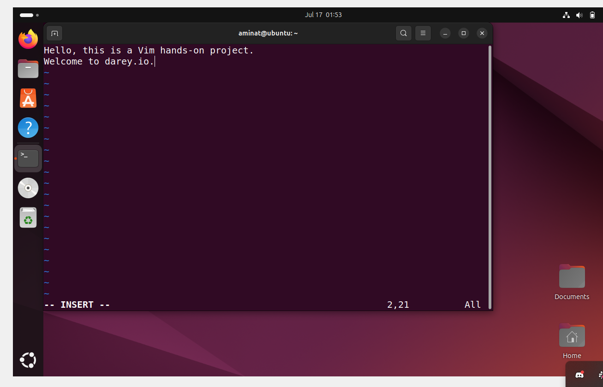
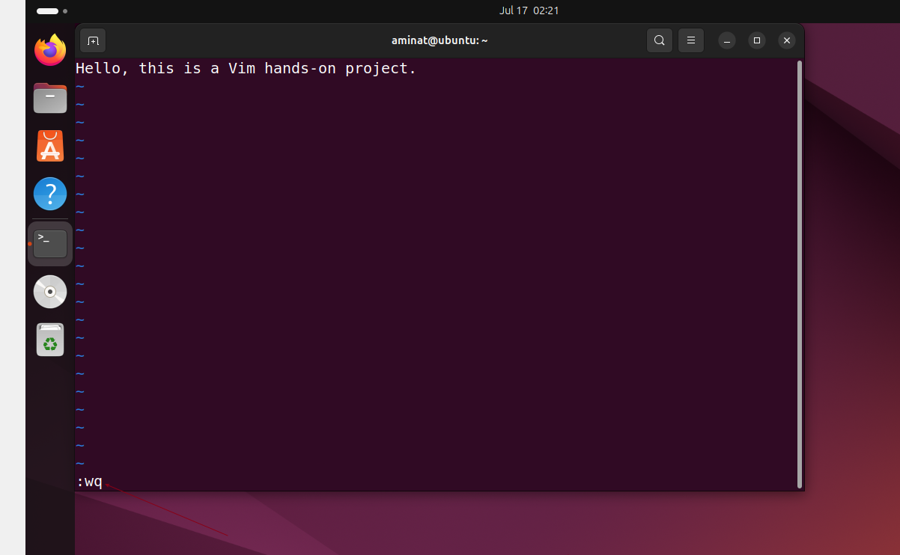

# Linux Text Editors
Linux text editor is a software application specifically designed for creating, modifying, and managing text files on a Linux-based operating system. Text editors play a crucial role in the Linux environment, providing a means for users to interact with and manipulate plain text files, configuration files, scripts, and other text based documents.
## Overview
This project demonstrates the basic usage of two essential Linux text editors:

* Vim: A powerful, modal text editor
* Nano: A user-friendly, beginner-friendly text editor
## Features
Both editors support the following basic operations:

* Creating new files
* Opening existing files
* Editing text
* Saving changes
* Exiting the editor
## Vim Text Editor
The Vim text editor is a powerful and versitile text editing tool deeply ingrained in the Unix and Linux ecosystem. Vim builds upon the foundation of the origial Vi editor, offering an extensive set of features, modes, and commands that empower users to manipulate efficiently. Here's how to use it:
### Basic Operations
1. ### Opening/Creating a File
```bash
vim exercise.txt
```
The command above creates a 'exercise.txt' file even if it doesn't exist. Then it opens the file up so that we can start writing into it.


2. ### Entering Insert Mode
* Press i to start typing
* The cursor will blink, indicating insert mode
```bash
i
```


3. ### Deleting Lines
* Press dd to delete an entire line
```bash
dd
```


4. ### Deleting Characters
* Press x to delete a single character
```bash
x
```


5. ### Undoing Changes
* Press u to undo the last change
```bash
u
```


6. ### Saving and Exiting
#### i. Save and Exit
* Press esc to return to command mode
* Type :wq and press enter
```bash
:wq
```

#### ii Exit Without Saving
* Press esc to return to command mode
* Type :q! and press enter
```bash
:q!
```


## Nano Text Editor
Nano is user-friendly and straightforward tool, making it an excellent choice for users who are new to the command line or those who prefer a more intuitive editing experience. Nano serves as a versatile and light weight text editor, ideal for performing quick edits, writing scripts, or making configuration changes directly from the command line. 
### Basic Operations
1. #### Opening/Creating a File
```bash
nano nano_file.txt
```


2. #### Saving Changes
* Press Ctrl + o to save
* Press Enter to confirm


3. #### Exiting Nano
* Press Ctrl + X


4. #### Adding New Lines
* Simply press Enter to add a new line
* Save and reopen the file to see changes
```bash
nano nano_file.txt
```


### Tips
* Use `man vim` or `man nano` in terminal for detailed documentation
